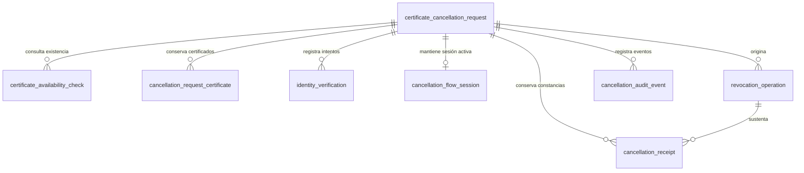

# Modelo de datos de solicitudes de cancelación

> La solicitud de cancelación representa el trámite ciudadano completo. La revocación es una operación técnica atómica ejecutada como consecuencia de la confirmación de dicha solicitud.

Este documento describe el esquema MySQL vigente después de las migraciones Flyway V1 a V7. El modelo efectivo mantiene ocho tablas. V7 incorpora una única sesión transaccional por solicitud activa y retira de `identity_verification` los campos de autorización temporal reemplazados. No existe una tabla por pantalla, paso, estado, navegador o dispositivo; la auditoría tampoco es la fuente de verdad del estado actual.

## Diagrama entidad-relación



Las claves primarias son internas, numéricas y no constituyen autorización. Las claves foráneas no usan eliminación en cascada.

## Responsabilidad de las ocho tablas

| Tabla | Responsabilidad | Justificación |
| --- | --- | --- |
| `certificate_cancellation_request` | Estado y progreso actual del trámite ciudadano. | Es la raíz conceptual y fuente directa del progreso. |
| `certificate_availability_check` | Cada consulta inicial que determina únicamente si existen certificados disponibles. | Una consulta puede fallar o repetirse y no contiene datos individuales. |
| `cancellation_request_certificate` | Cada emisión vigente que obtendrá el futuro segundo servicio después de autenticar al ciudadano. | Conserva la lista detallada y la selección sin mezclarla con la consulta inicial. |
| `identity_verification` | Cada intento de autenticación con ID Perú, su state hasheado y PKCE protegido. | La verificación puede cancelarse, fallar o repetirse sin guardar códigos ni tokens. |
| `cancellation_flow_session` | Sesión transaccional única de la solicitud activa, estado, familia y hashes de refresh. | Permite recargas y renovación segura sin recuperar trámites históricos ni guardar tokens en texto plano. |
| `revocation_operation` | Cada ejecución técnica idempotente y atómica de revocación. | Conserva el único resultado técnico del conjunto confirmado. |
| `cancellation_receipt` | Generación y disponibilidad de la constancia. | Su falla no cambia una revocación ya confirmada. |
| `cancellation_audit_event` | Trazabilidad cronológica mínima. | Conserva hechos relevantes sin implementar event sourcing. |

## Solicitud principal

`certificate_cancellation_request` conserva el DNI, `request_status`, `availability_result`, motivo, descripción de `OTHER`, confirmación, resultado final y fechas técnicas. `availability_result` solo indica si la existencia fue confirmada; no significa que la lista detallada ya se obtuvo. El DNI sigue siendo legible dentro de MySQL para el MVP, pero no se expone en logs, URLs, errores ni endpoints técnicos.

`certificate_availability_check` registra cada intento del primer servicio con estado técnico, resultado `AVAILABLE`, `NOT_AVAILABLE`, `INCONCLUSIVE`, `UNAVAILABLE` o `ERROR`, fechas, correlación y referencias controladas. No almacena cantidad, número de orden, fecha de creación ni UUID. Un resultado positivo deja la solicitud en `PENDING_IDENTITY_VERIFICATION` y cero filas de certificados.

La solicitud no contiene colecciones JPA automáticas. Los intentos, certificados, operaciones y constancias se consultan con sus repositorios cuando un caso de uso los requiere.

## Certificados consultados y selección

`cancellation_request_certificate` contiene la solicitud propietaria, número de orden, fecha de emisión, UUID canónico, disponibilidad, fecha de consulta, selección, fecha de selección, versión optimista y fechas técnicas. Queda reservada para el segundo servicio posterior a la autenticación.

Una solicitud puede tener cero, uno o varios certificados. La selección se guarda sobre la misma fila; no existe una tabla adicional de selección. `(request_id, certificate_uuid)` es único. No existe `eligibility_check_id` ni otra relación con la consulta inicial porque ese servicio nunca obtiene certificados.

`selected` y `selected_at` siempre son coherentes. Antes de confirmar pueden seleccionarse uno, varios o todos los certificados disponibles. Después de `confirmed_at`, las filas no pueden agregarse ni cambiar su selección. Los no seleccionados permanecen fuera de la operación y no cambian de disponibilidad por la revocación.

Las filas seleccionadas constituyen el conjunto atómico: sus UUID se envían juntos bajo una única clave de idempotencia. No se crea una tabla snapshot porque las mismas filas quedan inmutables tras la confirmación.

## Operación de revocación atómica

`revocation_operation` conserva la llamada técnica global, la clave única de idempotencia, el estado, las referencias y fechas técnicas, y `normalized_result` como resultado autoritativo. Los únicos resultados normalizados son:

- `SUCCEEDED`: todos los certificados seleccionados fueron revocados.
- `FAILED`: ninguno de los certificados seleccionados fue revocado.
- `OUTCOME_UNKNOWN`: todavía no puede confirmarse éxito ni fallo.

No existe `PARTIAL` ni se calculan resultados mezclando filas independientes. Una respuesta diferente por UUID contradice el contrato de todos o ninguno y debe rechazarse como incompatible. `OUTCOME_UNKNOWN` conserva la misma operación y clave de idempotencia para reconciliación, y bloquea una ejecución incompatible.

No existe `certificate_revocation_result`: duplicar un resultado común por cada certificado añadiría relaciones, columnas y concurrencia sin aportar información. El conjunto afectado se obtiene de las filas seleccionadas y el resultado se obtiene de la operación.

## Constancia

`cancellation_receipt` se asocia con la solicitud y la operación que la sustenta. La constancia debe identificar los certificados seleccionados y reflejar el único resultado común. El documento no se guarda como BLOB. Un fallo documental no transforma una revocación atómica ya confirmada en fallo.

## Estados controlados

- Consulta inicial: `STARTED`, `CHECKING_AVAILABILITY`, `NO_CERTIFICATES_AVAILABLE` y `PENDING_IDENTITY_VERIFICATION`.
- Etapa autenticada y selección: `IDENTITY_VERIFIED`, `AUTHENTICATED_PENDING_CERTIFICATE_LIST`, `CHECKING_CERTIFICATE_LIST`, `NO_CERTIFICATES_AVAILABLE`, `CERTIFICATES_AVAILABLE` y `CERTIFICATES_SELECTED`.
- Etapas posteriores: `REVOCATION_IN_PROGRESS`, `REVOCATION_SUCCEEDED`, `REVOCATION_FAILED`, `REVOCATION_OUTCOME_UNKNOWN`, `COMPLETED`, `FAILED`, `OUTCOME_UNKNOWN`, `RECEIPT_AVAILABLE` y `ABANDONED`.
- Disponibilidad: `AVAILABLE`, `NO_LONGER_AVAILABLE`, `REVOCATION_PENDING`, `REVOKED`, `REVOCATION_FAILED` y `OUTCOME_UNKNOWN`.
- Resultado de operación: `SUCCEEDED`, `FAILED` y `OUTCOME_UNKNOWN`.

Los estados son enums del backend almacenados como `VARCHAR`; no existen tablas catálogo.

## Integridad, índices y concurrencia

- Los intentos usan unicidad `(request_id, attempt_number)`.
- `idempotency_key`, `receipt_code` y `(request_id, certificate_uuid)` son únicos según su responsabilidad.
- La consulta inicial solo referencia la solicitud y nunca es fuente de una fila de certificado.
- Los checks verifican UUID canónico, fechas coherentes y consistencia de selección.
- Los índices permiten listar certificados por solicitud, consultar seleccionados o disponibles y recuperar intentos e historial.
- `@Version` protege la fila de certificado que puede modificarse concurrentemente antes de confirmar.
- Un conflicto de versión se rechaza para que el caso de uso recargue el estado; no hay reintentos automáticos generales.
- La reserva `CHECKING_CERTIFICATE_LIST` evita llamadas simultáneas al segundo servicio. Si una ejecución queda interrumpida, una reserva vencida puede recuperarse; un fallo técnico vuelve a `AUTHENTICATED_PENDING_CERTIFICATE_LIST`.
- La respuesta externa se valida completa antes de insertar. Una lista vacía conserva cero filas y una lista válida se guarda de manera atómica con unicidad `(request_id, certificate_uuid)`.
- Finalizar conserva certificados, selecciones, operaciones, constancias y auditoría. El borrado físico queda restringido mientras exista historial relacionado.

## Datos y seguridad

El UUID se almacena una sola vez, en la fila del certificado, con formato canónico legible. No se crean columnas `_cipher`, hashes duplicados ni versiones de clave sin infraestructura institucional confirmada.

- No registrar DNI, UUID, motivos libres, tokens, biometría ni payloads externos completos.
- No mostrar datos de certificados antes de autenticar al ciudadano.
- Conocer un identificador interno o UUID no autentica ni autoriza una revocación.
- No almacenar PDF como BLOB; la constancia usa una referencia de almacenamiento.
- Restringir el acceso directo a MySQL según el ambiente.

## Nuevas solicitudes e historial

Cada envío del DNI desde la página de inicio representa una intención nueva. El backend bloquea la solicitud más reciente del DNI únicamente para tomar una decisión segura:

1. Si la solicitud anterior todavía no fue confirmada, la marca `ABANDONED` y crea otra solicitud.
2. Si la solicitud anterior es terminal, conserva su historial y crea otra solicitud.
3. Si existe una consulta en curso, una revocación confirmada activa o un resultado incierto, bloquea temporalmente el nuevo inicio para evitar duplicidades.

Ese bloqueo no recupera el trámite anterior ni devuelve su identificador, paso, certificados, selección o constancia. `cancellation_flow_session` mantiene únicamente la operación actual y se invalida al cerrar sesión; no representa recuperación multidispositivo ni historial de sesiones.

## Migraciones Flyway

- `V1__create_cancellation_request_model.sql` permanece inmutable y crea las seis tablas originales.
- `V2__add_request_certificates_and_revocation_results.sql` agrega el certificado de solicitud y la estructura individual que entonces estaba prevista.
- `V3__add_spanish_schema_comments.sql` documenta en español las ocho tablas y 95 columnas existentes en V3.
- `V4__enforce_atomic_certificate_revocation.sql` elimina `certificate_revocation_result` y las dos claves candidatas que solo soportaban sus relaciones.
- `V5__separate_certificate_availability_from_listing.sql` renombra la consulta y el resultado iniciales a disponibilidad, convierte valores heredados inequívocos y elimina de los certificados la relación incorrecta con el primer intento.
- `V6__add_id_peru_identity_security.sql` agrega modo, hash/expiración/consumo de state, verifier PKCE cifrado temporalmente, referencias técnicas y hash/vigencia/invalidez de la autorización.
- `V7__add_citizen_flow_session.sql` crea la sesión transaccional y elimina de la verificación los campos de autorización que ya no son fuente de continuidad.
- Una base vacía ejecuta V1 a V7 y termina con las mismas ocho tablas.
- Una base existente en V6 ejecuta V7 sin perder solicitudes, intentos, verificaciones, certificados, selecciones, operaciones, constancias ni auditoría.

Flyway no revierte migraciones automáticamente. Cualquier cambio posterior requiere una nueva migración hacia adelante.

## Comentarios del esquema

Las descripciones se almacenan como `TABLE_COMMENT` y `COLUMN_COMMENT` nativos de MySQL y son visibles desde MySQL Workbench. Toda tabla y columna efectiva conserva un comentario en español. Las reglas funcionales detalladas continúan en `docs/context/PROJECT_CONTEXT.md`.

Toda migración futura que cree una tabla o columna de dominio debe incluir en esa misma migración un comentario conciso en español y ampliar la prueba de cobertura.

## Consultas de inspección

```sql
-- Tablas y descripciones vigentes.
SELECT table_name, table_comment
FROM information_schema.tables
WHERE table_schema = DATABASE()
  AND table_name <> 'flyway_schema_history'
ORDER BY table_name;

-- Certificados obtenidos y conjunto confirmado.
SELECT order_number, emission_created_at, certificate_uuid,
       availability_status, selected, selected_at
FROM cancellation_request_certificate
WHERE request_id = 1
ORDER BY emission_created_at, id;

-- Intentos del primer servicio; un AVAILABLE no crea certificados.
SELECT request_id, attempt_number, check_status, normalized_result,
       error_code, correlation_id, requested_at, responded_at
FROM certificate_availability_check
WHERE request_id = 1
ORDER BY attempt_number;

-- Operaciones atómicas y su resultado común.
SELECT id, idempotency_key, operation_status, normalized_result,
       correlation_id, created_at, updated_at
FROM revocation_operation
WHERE request_id = 1
ORDER BY id;

-- Constancia asociada con la operación.
SELECT c.receipt_code, c.generation_status, c.generated_at,
       r.normalized_result
FROM cancellation_receipt c
JOIN revocation_operation r ON r.id = c.revocation_operation_id
WHERE c.request_id = 1;
```

Los valores son ficticios. La integración real del segundo servicio, la revocación y la generación de la constancia pertenecen a incrementos posteriores; la persistencia y pantalla de selección ya utilizan este modelo.
