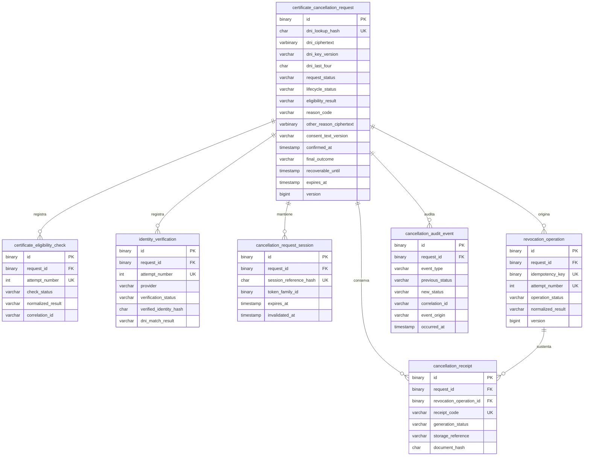

# Modelo de datos de solicitudes de cancelación

> La solicitud de cancelación representa el trámite ciudadano completo. La revocación es una operación técnica ejecutada como consecuencia de la confirmación de dicha solicitud.

Este modelo es un snapshot transaccional del estado actual más historiales independientes para intentos y trazabilidad. No representa un expediente sujeto a aprobación administrativa y no utiliza event sourcing.

## Diagrama entidad-relación

## Responsabilidad de las entidades

- `certificate_cancellation_request`: raíz y fuente de verdad del estado actual. Conserva elegibilidad vigente, motivo, consentimiento, resultado y ventanas de recuperación/expiración.
- `certificate_eligibility_check`: un registro por consulta o reintento controlado; no guarda el payload externo.
- `identity_verification`: un registro por intento con resultado normalizado; excluye biometría, fotografías y tokens de ID Perú.
- `cancellation_request_session`: sesiones con vigencia e invalidación independientes. Permite varias sesiones futuras después de una nueva verificación de identidad.
- `revocation_operation`: llamada técnica idempotente al proveedor. Una respuesta incierta pertenece a la misma operación y debe reconciliarse.
- `cancellation_receipt`: evidencia documental de una revocación exitosa. Una falla de generación no revierte la cancelación confirmada.
- `cancellation_audit_event`: historial append-only para trazabilidad. No reconstruye el estado actual.

Las relaciones JPA son unidireccionales desde los hijos hacia la solicitud y se cargan de forma lazy. La solicitud no contiene colecciones automáticas de historiales.

## Estados controlados

La solicitud admite `STARTED`, `CHECKING_ELIGIBILITY`, `NOT_ELIGIBLE`, `ELIGIBLE`, `PENDING_IDENTITY_VERIFICATION`, `IDENTITY_VERIFIED`, `REASON_REGISTERED`, `PENDING_CONFIRMATION`, `CONFIRMED`, `REVOCATION_IN_PROGRESS`, `COMPLETED`, `FAILED`, `OUTCOME_UNKNOWN`, `RECEIPT_AVAILABLE`, `EXPIRED` y `ABANDONED`.

Su clasificación estable es `ACTIVE`, `FINALIZED`, `ABANDONED` o `EXPIRED`. `OUTCOME_UNKNOWN` permanece activo hasta reconciliar la operación. Los motivos son `THEFT`, `LOSS`, `DEVICE_OR_NUMBER_CHANGE`, `SUSPECTED_UNAUTHORIZED_USE` y `OTHER`; no existe tabla de catálogo.

Elegibilidad normaliza `ELIGIBLE`, `NOT_ELIGIBLE`, `UNAVAILABLE` e `INCONCLUSIVE`. Identidad utiliza `STARTED`, `VERIFIED`, `REJECTED`, `CANCELLED`, `IDENTITY_MISMATCH` y `ERROR`. Revocación utiliza `PREPARED`, `SUBMITTED`, `SUCCEEDED`, `FAILED` y `OUTCOME_UNKNOWN`. Constancia utiliza `PENDING`, `GENERATING`, `AVAILABLE` y `FAILED`.

## Protección de datos

| Propósito | Campo | Tratamiento |
| --- | --- | --- |
| Búsqueda controlada | `dni_lookup_hash` | HMAC determinístico producido antes de persistir; un SHA-256 directo no es suficiente. |
| Recuperación autorizada | `dni_ciphertext` + `dni_key_version` | Cifrado y versión de clave; no existe columna de DNI en texto plano. |
| Presentación | `dni_last_four` | Únicamente cuatro dígitos. |
| Otro motivo | `other_reason_ciphertext` + versión de clave | Descripción protegida; nunca texto plano. |
| Sesión | `session_reference_hash` | Solo hash de referencia; no se guarda JWT ni refresh token. |
| Documento | `storage_reference` + `document_hash` | Referencia externa y hash; el PDF no se almacena en MySQL. |

La implementación criptográfica institucional, rotación y custodia de claves queda desacoplada y pendiente. Las entidades reciben valores ya protegidos. Tampoco existen columnas para secretos, credenciales, biometría, fotografías o respuestas externas completas.

## Integridad, índices y concurrencia

- Todos los identificadores son UUID `BINARY(16)` generados por la aplicación; no se exponen secuencias.
- Las claves foráneas no eliminan en cascada porque la retención aún no está aprobada.
- `(request_id, attempt_number)` es único en elegibilidad, identidad y revocación.
- `active_dni_guard` es una columna generada nullable con índice único: permite historial, pero solo una solicitud `ACTIVE` por HMAC de DNI.
- `open_request_guard` es una columna generada nullable con índice único: solo permite una revocación `PREPARED`, `SUBMITTED` u `OUTCOME_UNKNOWN` por solicitud.
- `idempotency_key`, `session_reference_hash` y `receipt_code` son únicos globalmente.
- Solicitud y revocación usan `@Version` para concurrencia optimista.
- Los checks validan formatos protegidos, pares campo/versión, fechas, consentimiento y valores controlados.
- Los índices cubren solicitud activa e histórica, expiración, últimos intentos, sesiones activas, revocación vigente, constancia disponible y auditoría cronológica.
- Todas las fechas representan instantes UTC; Hibernate fija la zona JDBC en UTC.

## Idempotencia y recuperación

La clave de idempotencia se crea antes de enviar una revocación y se reutiliza al repetir la entrega de la misma operación. `OUTCOME_UNKNOWN` no autoriza una operación nueva: primero debe consultarse o reconciliarse la existente. Un nuevo intento técnico solo puede existir después de resolver el anterior según reglas funcionales futuras.

La recuperación localizará como máximo una solicitud activa por `dni_lookup_hash`. Después de verificar nuevamente la identidad, una tarea futura podrá crear otra sesión asociada a la misma solicitud; las sesiones anteriores conservan su historial e invalidación. Este esquema habilita esa capacidad, pero no implementa JWT ni el caso de uso multidispositivo.

## Reglas transaccionales no expresadas con triggers

Una constancia solo puede crearse para una operación `SUCCEEDED` de la misma solicitud. MySQL no puede verificar el estado de otra fila mediante un `CHECK`; por ello la entidad valida la asociación y las pruebas de integración cubren la regla. No se usan triggers complejos ni procedimientos almacenados.

La auditoría es inmutable desde el modelo de aplicación. La solicitud sigue siendo la fuente de verdad y los eventos no se reproducen para reconstruirla.

## Dependencias todavía no confirmadas

- Servicio institucional de cifrado/HMAC, algoritmos, identificadores y rotación de claves.
- Formatos y códigos definitivos de consulta de certificados, ID Perú y revocación.
- Almacenamiento externo de constancias y formato de su referencia opaca.
- Longitud y política de contenido definitiva para “Otro motivo”.
- Retención y eliminación de solicitudes, sesiones, operaciones, constancias y auditoría.
- Detalle técnico permitido institucionalmente en eventos de auditoría.
