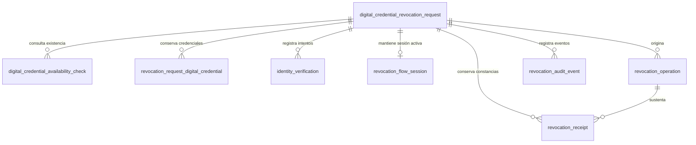

# Modelo de datos de solicitudes de revocación

> La solicitud de revocación representa el trámite ciudadano completo. Cada solicitud selecciona y posteriormente revoca una única credencial digital.

Este documento describe el esquema MySQL vigente después de las migraciones Flyway V1 a V15. El modelo efectivo mantiene ocho tablas. V11 adopta la terminología de credenciales digitales y revocación sin alterar los checksums de V1–V10. No existe una tabla por pantalla, paso, estado, navegador o dispositivo; la auditoría tampoco es la fuente de verdad del estado actual.

## Diagrama entidad-relación



Las claves primarias son internas, numéricas y no constituyen autorización. Las claves foráneas no usan eliminación en cascada.

## Responsabilidad de las ocho tablas

| Tabla | Responsabilidad | Justificación |
| --- | --- | --- |
| `digital_credential_revocation_request` | Estado y progreso actual del trámite ciudadano. | Es la raíz conceptual y fuente directa del progreso. |
| `digital_credential_availability_check` | Cada consulta inicial que determina únicamente si existen credenciales disponibles. | Una consulta puede fallar o repetirse y no contiene datos individuales. |
| `revocation_request_digital_credential` | Cada emisión vigente obtenida del proveedor después de autenticar al ciudadano. | Conserva la lista detallada y la selección sin mezclarla con la consulta inicial. |
| `identity_verification` | Cada intento de autenticación con ID Perú, su state hasheado, PKCE protegido y el primer nombre solo cuando fue verificado. | La verificación puede revocarse, fallar o repetirse sin guardar códigos ni tokens; los intentos no exitosos no incorporan el nombre. |
| `revocation_flow_session` | Sesión transaccional única de la solicitud activa, estado, familia y hashes de refresh. | Permite recargas y actualización segura de la sesión sin recuperar trámites históricos ni guardar tokens en texto plano. |
| `revocation_operation` | Cada ejecución técnica idempotente de revocación. | Conserva el resultado técnico de la credencial confirmada. |
| `revocation_receipt` | Generación y disponibilidad de la constancia. | Su falla no cambia una revocación ya confirmada. |
| `revocation_audit_event` | Trazabilidad cronológica mínima. | Conserva hechos relevantes sin implementar event sourcing. |

## Solicitud principal

`digital_credential_revocation_request` conserva el DNI, `request_status`, `availability_result`, motivo, descripción de `OTHER`, `confirmed_at`, `consent_version`, resultado final y fechas técnicas. El motivo permanece nulo mientras el ciudadano edita los pasos 2 y 3 y se guarda únicamente dentro de la transacción de confirmación. `availability_result` solo indica si la existencia fue confirmada; no significa que la lista detallada ya se obtuvo. El DNI sigue siendo legible dentro de MySQL para el MVP, pero no se expone en logs, URLs, errores ni endpoints técnicos.

`consent_version` identifica el texto estable aceptado por el ciudadano; el texto completo se mantiene en el catálogo del backend y no se repite en cada fila. La combinación de `confirmed_at`, esa versión y el evento `CONSENT_CONFIRMED` constituye la evidencia técnica. Los registros históricos pueden conservar el campo nulo.

`digital_credential_availability_check` registra cada intento del primer servicio con estado técnico, resultado `AVAILABLE`, `NOT_AVAILABLE`, `INCONCLUSIVE`, `UNAVAILABLE` o `ERROR`, fechas, correlación y referencias controladas. No almacena cantidad, número de orden, fecha de creación ni UUID. Un resultado positivo deja la solicitud en `PENDING_IDENTITY_VERIFICATION` y cero filas de credenciales.

La solicitud no contiene colecciones JPA automáticas. Los intentos, credenciales, operaciones y constancias se consultan con sus repositorios cuando un caso de uso los requiere.

## Credenciales consultadas y selección

`revocation_request_digital_credential` contiene la solicitud propietaria, `status_list_index`, tipo interno del proveedor, estado crudo validado, fecha de emisión, UUID canónico, disponibilidad, fecha externa de revocación, fecha de consulta, selección, fecha de selección, versión optimista y fechas técnicas. `legacy_order_number` queda nullable y solo conserva evidencia anterior a V15; nunca se convierte artificialmente en un índice oficial.

Una solicitud puede tener cero, uno o varias credenciales. La selección se guarda sobre la misma fila; no existe una tabla adicional de selección. El UUID puede repetirse: `(request_id, digital_credential_uuid, status_list_index)` identifica la fila y es único, mientras `(request_id, status_list_index)` impide índices repetidos. No existe `eligibility_check_id` ni otra relación con la consulta inicial porque ese servicio nunca obtiene credenciales.

`selected` y `selected_at` siempre son coherentes. Todas las credenciales permanecen sin seleccionar mientras el ciudadano edita el borrador en memoria. Al confirmar, exactamente una credencial disponible se marca como seleccionada en la misma transacción que registra motivo, consentimiento y `confirmed_at`. El índice funcional único `uq_revocation_request_single_selected` impide que dos filas de una solicitud queden seleccionadas. Después de `confirmed_at`, las filas no pueden agregarse ni cambiar su selección. Las no seleccionadas permanecen fuera de la operación.

La fila seleccionada constituye el objetivo de la operación: su UUID y su índice se combinan con el DNI persistido de la solicitud. Ninguno de esos valores se vuelve a aceptar desde el navegador. Una fila histórica sin índice oficial se bloquea de forma controlada. No se crea una tabla snapshot porque esa misma fila queda inmutable tras la confirmación.

## Operación de revocación atómica

`revocation_operation` conserva la llamada técnica global, la clave única de idempotencia, el estado, las referencias y fechas técnicas, `provider_credential_status` y `normalized_result` como resultado autoritativo. Los únicos resultados normalizados son:

- `SUCCEEDED`: la credencial seleccionada fue revocada.
- `FAILED`: la credencial seleccionada no fue revocada.
- `OUTCOME_UNKNOWN`: todavía no puede confirmarse éxito ni fallo.

No existe `PARTIAL` porque cada solicitud opera sobre una credencial. `OUTCOME_UNKNOWN` conserva la misma operación y clave de idempotencia para reconciliación, y bloquea una ejecución incompatible.

No existe una tabla de resultados individuales: cada solicitud solo puede confirmar una credencial, por lo que la credencial afectada se obtiene de su única fila seleccionada y el resultado se obtiene directamente de la operación.

## Constancia

`revocation_receipt` se asocia con la solicitud y la operación que la sustenta. Ante un resultado exitoso se crea en `PENDING`; el instante elegible se deriva de `revocation_operation.completed_at` más el retraso de propagación configurado. Un procesador backend recupera filas `PENDING`, generaciones abandonadas y operaciones exitosas que aún no tengan constancia. El documento no se guarda como BLOB y un fallo documental no transforma una revocación ya confirmada en fallo.

## Estados controlados

- Consulta inicial: `STARTED`, `CHECKING_AVAILABILITY`, `NO_DIGITAL_CREDENTIALS_AVAILABLE` y `PENDING_IDENTITY_VERIFICATION`.
- Etapa autenticada y selección: `IDENTITY_VERIFIED`, `AUTHENTICATED_PENDING_DIGITAL_CREDENTIAL_LIST`, `CHECKING_DIGITAL_CREDENTIAL_LIST`, `NO_DIGITAL_CREDENTIALS_AVAILABLE`, `DIGITAL_CREDENTIALS_AVAILABLE` y `DIGITAL_CREDENTIALS_SELECTED`.
- Etapas posteriores: `REVOCATION_IN_PROGRESS`, `REVOCATION_SUCCEEDED`, `REVOCATION_FAILED`, `REVOCATION_OUTCOME_UNKNOWN`, `COMPLETED`, `FAILED`, `OUTCOME_UNKNOWN`, `RECEIPT_AVAILABLE` y `ABANDONED`.
- Disponibilidad: `AVAILABLE`, `NO_LONGER_AVAILABLE`, `REVOCATION_PENDING`, `REVOKED`, `REVOCATION_FAILED` y `OUTCOME_UNKNOWN`.
- Resultado de operación: `SUCCEEDED`, `FAILED` y `OUTCOME_UNKNOWN`.

Los estados son enums del backend almacenados como `VARCHAR`; no existen tablas catálogo.

## Integridad, índices y concurrencia

- Los intentos usan unicidad `(request_id, attempt_number)`.
- `idempotency_key`, `receipt_code` y `(request_id, digital_credential_uuid)` son únicos según su responsabilidad.
- La consulta inicial solo referencia la solicitud y nunca es fuente de una fila de credencial.
- Los checks verifican UUID canónico, fechas coherentes y consistencia de selección.
- El índice funcional único permite varios valores `NULL`, pero como máximo un `request_id` cuando `selected=true`. Su migración falla si encuentra datos previos incompatibles y nunca elige ni elimina una fila de forma silenciosa.
- Los índices permiten listar credenciales por solicitud, consultar la única seleccionada o las disponibles y recuperar intentos e historial.
- `@Version` protege la fila de credencial que puede modificarse concurrentemente antes de confirmar.
- Un conflicto de versión se rechaza para que el caso de uso recargue el estado; no hay reintentos automáticos generales.
- La reserva `CHECKING_DIGITAL_CREDENTIAL_LIST` evita llamadas simultáneas al segundo servicio. Si una ejecución queda interrumpida, una reserva vencida puede recuperarse; un fallo técnico vuelve a `AUTHENTICATED_PENDING_DIGITAL_CREDENTIAL_LIST`.
- La respuesta externa se valida completa antes de insertar. Antes de confirmar, cada consulta reemplaza atómicamente la fotografía previa; si falla, las filas anteriores se conservan solo como evidencia interna. Una respuesta vacía o formada solo por revocadas finaliza sin credenciales disponibles, y los UUID pueden repetirse cuando el índice oficial es distinto. Al confirmar, la fotografía revalidada y la tupla seleccionada quedan inmutables.
- Finalizar conserva credenciales, selecciones, operaciones, constancias y auditoría. El borrado físico queda restringido mientras exista historial relacionado.

## Datos y seguridad

El UUID se almacena una sola vez, en la fila de la credencial, con formato canónico legible. No se crean columnas `_cipher`, hashes duplicados ni versiones de clave sin infraestructura institucional confirmada.

- No registrar DNI, UUID, motivos libres, tokens, biometría ni payloads externos completos.
- No mostrar datos de credenciales antes de autenticar al ciudadano.
- Conocer un identificador interno o UUID no autentica ni autoriza una revocación.
- No almacenar PDF como BLOB; la constancia usa una referencia de almacenamiento.
- Restringir el acceso directo a MySQL según el ambiente.

## Nuevas solicitudes e historial

Cada envío del DNI desde la página de inicio representa una intención nueva. El backend bloquea la solicitud más reciente del DNI únicamente para tomar una decisión segura:

1. Si la solicitud anterior todavía no fue confirmada, la marca `ABANDONED` y crea otra solicitud.
2. Si la solicitud anterior es terminal, conserva su historial y crea otra solicitud.
3. Si existe una consulta en curso, una revocación confirmada activa o un resultado incierto, bloquea temporalmente el nuevo inicio para evitar duplicidades.

Ese bloqueo no recupera el trámite anterior ni devuelve su identificador, paso, credenciales, selección o constancia. `revocation_flow_session` mantiene únicamente la operación actual y se invalida al cerrar sesión; no representa recuperación multidispositivo ni historial de sesiones.

## Migraciones Flyway

- `V1__create_cancellation_request_model.sql` permanece inmutable y crea las seis tablas originales.
- `V2__add_request_certificates_and_revocation_results.sql` agrega la credencial de solicitud y la estructura individual que entonces estaba prevista.
- `V3__add_spanish_schema_comments.sql` documenta en español las ocho tablas y 95 columnas existentes en V3.
- `V4__enforce_atomic_certificate_revocation.sql` elimina `certificate_revocation_result` y las dos claves candidatas que solo soportaban sus relaciones.
- `V5__separate_certificate_availability_from_listing.sql` renombra la consulta y el resultado iniciales a disponibilidad, convierte valores heredados inequívocos y elimina de las credenciales la relación incorrecta con el primer intento.
- `V6__add_id_peru_identity_security.sql` agrega modo, hash/expiración/consumo de state, verifier PKCE cifrado temporalmente, referencias técnicas y hash/vigencia/invalidez de la autorización.
- `V7__add_citizen_flow_session.sql` crea la sesión transaccional y elimina de la verificación los campos de autorización que ya no son fuente de continuidad.
- `V8__add_confirmation_consent_version.sql` registra la versión del consentimiento ciudadano.
- `V9__enforce_single_certificate_selection.sql` agrega la restricción de una sola fila seleccionada por solicitud, sin crear tablas o columnas.
- `V10__defer_cancellation_draft_until_confirmation.sql` limpia borradores persistidos por el flujo anterior y difiere la decisión hasta confirmar.
- `V11__rename_to_digital_credential_revocation.sql` renombra tablas, columnas, índices, relaciones y valores persistidos a credenciales digitales y revocación.
- `V12__add_digital_credential_revocation_date.sql` conserva la fecha externa de revocación y recupera la fecha de operaciones exitosas existentes.
- `V13__index_pending_receipt_processing.sql` optimiza la recuperación de constancias pendientes o abandonadas por el procesador en segundo plano.
- `V14__persist_verified_first_name.sql` conserva el claim `first_name` de verificaciones exitosas y obliga a repetir el paso 1 en solicitudes incompletas históricas que no disponen de ese dato.
- V1–V10 conservan nombres históricos inmutables porque Flyway valida sus checksums; esos nombres no describen el contrato vigente.
- Una base vacía ejecuta V1 a V15 y termina con las mismas ocho tablas bajo los nombres actuales.
- Una base existente en V8 ejecuta V9 sin perder datos compatibles. Si contiene varias selecciones por solicitud, la migración se detiene para exigir una decisión explícita.

Flyway no revierte migraciones automáticamente. Cualquier cambio posterior requiere una nueva migración hacia adelante.

## Comentarios del esquema

Las descripciones se almacenan como `TABLE_COMMENT` y `COLUMN_COMMENT` nativos de MySQL y son visibles desde MySQL Workbench. Toda tabla y columna efectiva conserva un comentario en español. Las reglas funcionales detalladas continúan en `docs/context/PROJECT_CONTEXT.md`.

Toda migración futura que cree una tabla o columna de dominio debe incluir en esa misma migración un comentario conciso en español y ampliar la prueba de cobertura.

## Consultas de inspección

```sql
-- Tablas y descripciones vigentes.
SELECT table_name, table_comment
FROM information_schema.tables
WHERE table_schema = DATABASE()
  AND table_name <> 'flyway_schema_history'
ORDER BY table_name;

-- Credenciales obtenidos y única selección de la solicitud.
SELECT order_number, emission_created_at, digital_credential_uuid,
       availability_status, selected, selected_at
FROM revocation_request_digital_credential
WHERE request_id = 1
ORDER BY emission_created_at, id;

-- Intentos del primer servicio; un AVAILABLE no crea credenciales.
SELECT request_id, attempt_number, check_status, normalized_result,
       error_code, correlation_id, requested_at, responded_at
FROM digital_credential_availability_check
WHERE request_id = 1
ORDER BY attempt_number;

-- Operación técnica y resultado del única credencial confirmada.
SELECT id, idempotency_key, operation_status, normalized_result,
       correlation_id, created_at, updated_at
FROM revocation_operation
WHERE request_id = 1
ORDER BY id;

-- Constancia asociada con la operación.
SELECT c.receipt_code, c.generation_status, c.generated_at,
       r.normalized_result
FROM revocation_receipt c
JOIN revocation_operation r ON r.id = c.revocation_operation_id
WHERE c.request_id = 1;
```

Los valores son ficticios. El perfil local utiliza adaptadores simulados y almacenamiento en filesystem; las integraciones institucionales de otros perfiles permanecen deshabilitadas hasta disponer de contratos oficiales.
