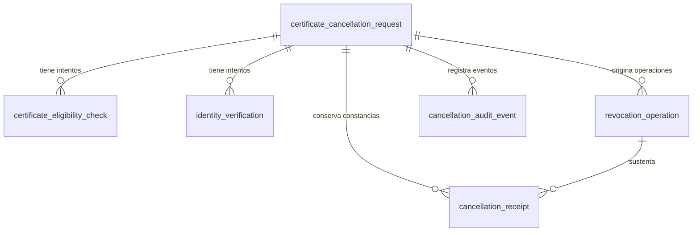

# Modelo de datos de solicitudes de cancelación

> La solicitud de cancelación representa el trámite ciudadano completo. La revocación es una operación técnica ejecutada como consecuencia de la confirmación de dicha solicitud.

El modelo tiene una tabla principal y cinco tablas relacionadas. No existe una tabla por pantalla, paso, estado, navegador o dispositivo. El estado actual se consulta directamente en la solicitud y la auditoría no es event sourcing.

## Diagrama entidad-relación



Todas las claves primarias son `BIGINT UNSIGNED AUTO_INCREMENT`. Las claves foráneas usan el mismo tipo y no eliminan información en cascada.

## Por qué existe cada tabla

| Tabla | Responsabilidad | Motivo de separación |
| --- | --- | --- |
| `certificate_cancellation_request` | Estado actual del trámite ciudadano. | Es la raíz y fuente directa del progreso. |
| `certificate_eligibility_check` | Cada consulta de elegibilidad. | La consulta externa puede fallar o repetirse. |
| `identity_verification` | Cada intento con ID Perú. | Una verificación puede cancelarse, fallar o repetirse. |
| `revocation_operation` | Ejecución técnica idempotente. | La revocación no es lo mismo que la solicitud ciudadana y puede tener resultado incierto. |
| `cancellation_receipt` | Generación y disponibilidad de constancias. | Una falla al generar la constancia no cambia una revocación confirmada. |
| `cancellation_audit_event` | Trazabilidad cronológica mínima. | Conserva hechos relevantes sin reconstruir el estado actual. |

## Solicitud principal

`certificate_cancellation_request` contiene únicamente:

| Columna | Descripción |
| --- | --- |
| `id` | Identificador numérico de la solicitud y referencia usada por la aplicación. No autentica ni autoriza. |
| `dni` | DNI completo de ocho dígitos, legible dentro de MySQL. |
| `request_status` | Estado actual y paso alcanzado, controlado por el backend. |
| `eligibility_result` | Resultado vigente de elegibilidad. |
| `reason_code` | Motivo controlado seleccionado por el ciudadano. |
| `other_reason` | Descripción legible y limitada cuando el motivo es `OTHER`. |
| `confirmed_at` | Momento en que se confirmó expresamente la solicitud. |
| `final_outcome` | Resultado final normalizado, cuando exista. |
| `created_at` | Fecha UTC de creación. |
| `updated_at` | Fecha UTC de última actualización. |

No contiene UUID público, versión de consentimiento, fecha de recuperación, fecha de expiración, paso duplicado ni versión optimista.

## Tablas relacionadas

| Tabla | Columnas funcionales principales |
| --- | --- |
| `certificate_eligibility_check` | `request_id`, intento, estado, resultado, referencia externa, fechas, error y correlación. |
| `identity_verification` | `request_id`, intento, proveedor, estado, referencia externa, coincidencia del DNI, fechas, error y correlación. |
| `revocation_operation` | `request_id`, clave de idempotencia, intento, estado, referencia externa, fechas, resultado, error y correlación. |
| `cancellation_receipt` | `request_id`, `revocation_operation_id`, código, estado, referencia de almacenamiento, fechas y error. |
| `cancellation_audit_event` | `request_id`, tipo, estado anterior/nuevo, resultado, correlación, origen y fecha. |

## Recuperación del progreso

Para el MVP, una solicitud sin finalizar siempre puede retomarse, independientemente del tiempo transcurrido:

1. El ciudadano vuelve a proporcionar su DNI.
2. El backend busca la solicitud más reciente del DNI en un estado retomable.
3. `request_status` indica directamente el paso alcanzado.
4. Se continúa sobre la misma solicitud.

No existe `cancellation_request_session`, no se crean filas por navegador o dispositivo y no se evalúa una fecha límite. Las solicitudes completadas, abandonadas o fallidas permanecen como historial.

JWT se diseñará en una tarea independiente. Conocer `id` no demuestra identidad ni autoriza operaciones sensibles.

## Estados controlados

- Solicitud: `STARTED`, `CHECKING_ELIGIBILITY`, `NOT_ELIGIBLE`, `ELIGIBLE`, `PENDING_IDENTITY_VERIFICATION`, `IDENTITY_VERIFIED`, `REASON_REGISTERED`, `PENDING_CONFIRMATION`, `CONFIRMED`, `REVOCATION_IN_PROGRESS`, `COMPLETED`, `FAILED`, `OUTCOME_UNKNOWN`, `RECEIPT_AVAILABLE` y `ABANDONED`.
- Elegibilidad: `NOT_CHECKED`, `ELIGIBLE`, `NOT_ELIGIBLE`, `UNAVAILABLE`, `INCONCLUSIVE` y `ERROR`.
- Motivos: `THEFT`, `LOSS`, `DEVICE_OR_NUMBER_CHANGE`, `SUSPECTED_UNAUTHORIZED_USE` y `OTHER`.
- Identidad: `STARTED`, `VERIFIED`, `REJECTED`, `CANCELLED`, `IDENTITY_MISMATCH` y `ERROR`.
- Revocación: `PREPARED`, `SUBMITTED`, `SUCCEEDED`, `FAILED` y `OUTCOME_UNKNOWN`.
- Constancia: `PENDING`, `GENERATING`, `AVAILABLE` y `FAILED`.

Los valores son enums del backend almacenados como `VARCHAR`; no hay tablas catálogo.

## Integridad, concurrencia e índices

- `(request_id, attempt_number)` es único para elegibilidad, identidad y revocación.
- `idempotency_key` y `receipt_code` son únicos.
- Las claves foráneas impiden registros relacionados sin solicitud.
- Los checks se limitan al DNI, intentos positivos y orden temporal básico.
- `idx_request_dni_status_created` localiza la solicitud más reciente por DNI y estado.
- Los índices restantes recuperan los últimos intentos, operación actual, constancia e historial.
- El inicio bloquea explícitamente la solicitud más reciente del DNI para evitar solicitudes activas duplicadas.
- No se usan columnas `version`, columnas generadas, procedimientos ni triggers.

## Datos y seguridad

El DNI se guarda una sola vez como `CHAR(8)` para que el esquema sea transparente e inspeccionable. Esta decisión no autoriza exponerlo fuera de MySQL:

- No incluir DNI ni motivo libre en logs, errores, URLs, métricas o endpoints técnicos.
- Restringir el acceso directo a MySQL según el ambiente.
- No guardar JWT, refresh tokens, contraseñas, credenciales, biometría, fotografías ni payloads externos completos.
- No almacenar archivos PDF como BLOB; `storage_reference` apuntará al almacenamiento que se defina posteriormente.
- No autorizar una operación sensible únicamente porque el cliente conozca el `requestId`.

## Idempotencia y auditoría

La revocación usa una `idempotency_key` única. Un resultado `OUTCOME_UNKNOWN` permanece en la misma operación hasta su reconciliación y no crea automáticamente otra revocación.

La auditoría es append-only desde la aplicación, pero la solicitud sigue siendo la fuente de verdad. Los eventos no se reproducen para reconstruir el estado.

## Consultas de inspección

```sql
-- Solicitudes recientes de un DNI y su progreso actual.
SELECT id, dni, request_status, eligibility_result, reason_code, created_at, updated_at
FROM certificate_cancellation_request
WHERE dni = '12345678'
ORDER BY created_at DESC;

-- Intentos de elegibilidad de una solicitud.
SELECT attempt_number, check_status, normalized_result, requested_at, responded_at
FROM certificate_eligibility_check
WHERE request_id = 1
ORDER BY attempt_number DESC;

-- Revocación, constancia y auditoría.
SELECT id, idempotency_key, operation_status, normalized_result, completed_at
FROM revocation_operation WHERE request_id = 1 ORDER BY attempt_number DESC;

SELECT receipt_code, generation_status, storage_reference, available_at
FROM cancellation_receipt WHERE request_id = 1;

SELECT event_type, previous_status, new_status, result, occurred_at
FROM cancellation_audit_event WHERE request_id = 1 ORDER BY occurred_at, id;
```

Los DNI de ejemplo son ficticios y no deben copiarse con datos reales a tickets, logs o conversaciones.

## Línea base Flyway

El proyecto permanece en etapa local y el volumen inspeccionado antes de esta simplificación contenía únicamente los fixtures ficticios `00000001` y `00000002`, sin sesiones, identidad, revocaciones, constancias ni auditoría. Por ello se consolidó una única `V1` limpia con seis tablas.

Una base local que ejecutó la V1 anterior debe recrearse solamente si sus datos son desechables. Si existe información relevante, no se debe limpiar ni reparar el historial: debe diseñarse una migración hacia adelante específica.
