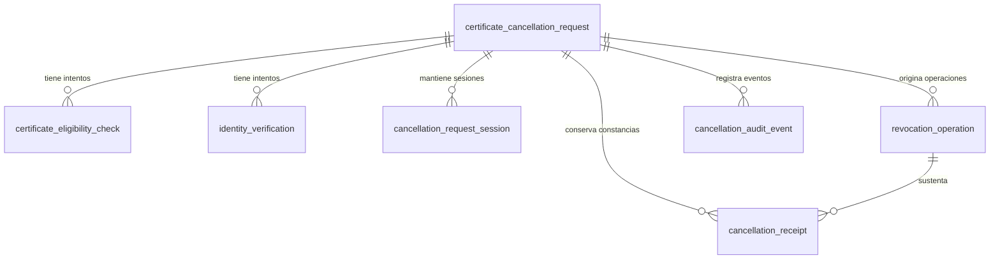

# Modelo de datos de solicitudes de cancelación

> La solicitud de cancelación representa el trámite ciudadano completo. La revocación es una operación técnica ejecutada como consecuencia de la confirmación de dicha solicitud.

El modelo mantiene el estado actual en la solicitud y separa únicamente los elementos que pueden repetirse o tienen un ciclo de vida propio. No existe una tabla por pantalla o estado y la auditoría no es event sourcing.

## Diagrama entidad-relación



Todas las claves primarias son `BIGINT UNSIGNED AUTO_INCREMENT`. Las claves foráneas usan el mismo tipo, no eliminan en cascada y no se expondrán directamente como identificadores públicos.

## Por qué existe cada tabla

| Tabla | Responsabilidad | Motivo de separación |
| --- | --- | --- |
| `certificate_cancellation_request` | Estado actual del trámite ciudadano. | Es la raíz y fuente de verdad del progreso. |
| `certificate_eligibility_check` | Cada consulta de elegibilidad. | Una consulta externa puede fallar o repetirse. |
| `identity_verification` | Cada intento con ID Perú. | El ciudadano puede cancelar, fallar o volver a intentarlo. |
| `cancellation_request_session` | Vigencia e invalidación de sesiones. | La recuperación desde otro dispositivo permite varias sesiones. |
| `revocation_operation` | Ejecución técnica idempotente. | Puede tener resultado incierto o reintento y no es la solicitud ciudadana. |
| `cancellation_receipt` | Generación y disponibilidad de constancias. | Su falla no cambia una revocación ya confirmada. |
| `cancellation_audit_event` | Trazabilidad cronológica mínima. | Registra hechos relevantes sin reconstruir el estado actual. |

## Columnas

### `certificate_cancellation_request`

| Columna | Descripción |
| --- | --- |
| `id` | Identificador interno numérico. |
| `dni` | DNI completo de ocho dígitos, legible dentro de MySQL. |
| `request_status` | Estado actual controlado por el backend. |
| `eligibility_result` | Resultado vigente de elegibilidad. |
| `reason_code` / `other_reason` | Motivo y descripción de hasta 300 caracteres cuando es `OTHER`. |
| `consent_version` / `confirmed_at` | Versión aceptada y momento de confirmación. |
| `final_outcome` | Resultado final normalizado, cuando exista. |
| `recoverable_until` / `expires_at` | Ventanas de recuperación y expiración. |
| `created_at` / `updated_at` | Fechas UTC de creación y actualización. |
| `version` | Control de concurrencia optimista mediante `@Version`. |

### Tablas relacionadas

| Tabla | Columnas funcionales principales |
| --- | --- |
| `certificate_eligibility_check` | `request_id`, `attempt_number`, `check_status`, `normalized_result`, `external_reference`, fechas, `error_code`, `correlation_id`. |
| `identity_verification` | `request_id`, `attempt_number`, `provider`, `verification_status`, `external_reference`, `dni_match_result`, fechas, error/cancelación y correlación. |
| `cancellation_request_session` | `request_id`, `session_reference`, creación, expiración, último uso, invalidación, motivo y actualización. |
| `revocation_operation` | `request_id`, `idempotency_key`, `attempt_number`, estado, referencia externa, fechas, resultado, `error_code`, correlación y `version`. |
| `cancellation_receipt` | `request_id`, `revocation_operation_id`, `receipt_code`, estado, referencia de almacenamiento, fechas y `error_code`. |
| `cancellation_audit_event` | `request_id`, tipo, estado anterior/nuevo, resultado, correlación, origen y fecha. |

## Estados controlados

- Solicitud: `STARTED`, `CHECKING_ELIGIBILITY`, `NOT_ELIGIBLE`, `ELIGIBLE`, `PENDING_IDENTITY_VERIFICATION`, `IDENTITY_VERIFIED`, `REASON_REGISTERED`, `PENDING_CONFIRMATION`, `CONFIRMED`, `REVOCATION_IN_PROGRESS`, `COMPLETED`, `FAILED`, `OUTCOME_UNKNOWN`, `RECEIPT_AVAILABLE`, `EXPIRED` y `ABANDONED`.
- Elegibilidad actual: `NOT_CHECKED`, `ELIGIBLE`, `NOT_ELIGIBLE`, `UNAVAILABLE` e `INCONCLUSIVE`.
- Motivos: `THEFT`, `LOSS`, `DEVICE_OR_NUMBER_CHANGE`, `SUSPECTED_UNAUTHORIZED_USE` y `OTHER`.
- Verificación de identidad: `STARTED`, `VERIFIED`, `REJECTED`, `CANCELLED`, `IDENTITY_MISMATCH` y `ERROR`.
- Revocación: `PREPARED`, `SUBMITTED`, `SUCCEEDED`, `FAILED` y `OUTCOME_UNKNOWN`.
- Constancia: `PENDING`, `GENERATING`, `AVAILABLE` y `FAILED`.

Los estados son enums del backend almacenados como `VARCHAR`. No existe una tabla catálogo ni grandes `CHECK` que dupliquen los enums.

## Integridad, unicidad e índices

- Todas las tablas relacionadas tienen claves foráneas y no usan borrado en cascada.
- `(request_id, attempt_number)` es único para elegibilidad, identidad y revocación.
- `session_reference`, `idempotency_key` y `receipt_code` son únicos.
- Solicitud y revocación usan concurrencia optimista.
- Los checks se limitan al DNI, intentos positivos y orden temporal básico.
- `idx_request_dni_status_created`: solicitudes recientes o activas por DNI.
- `idx_request_expiration`: candidatos a expiración.
- `idx_eligibility_latest` e `idx_identity_latest_valid`: últimos intentos.
- `idx_session_active`: sesiones vigentes.
- `idx_revocation_current`: operación técnica actual.
- `idx_receipt_available`: constancia disponible.
- `idx_audit_history`: historial cronológico.

La regla de una solicitud activa incompatible por DNI y la regla de una operación técnica vigente se implementarán transaccionalmente cuando existan esos casos de uso. No se usan columnas generadas ni triggers para anticiparlas.

## Datos y seguridad

El DNI se guarda deliberadamente en una sola columna `dni CHAR(8)` para que el modelo sea transparente e inspeccionable. `other_reason` también es texto legible y limitado. Esta decisión no autoriza exponer esos valores fuera de la persistencia:

- No incluir DNI ni motivo libre en logs, excepciones, errores API, URLs, métricas o endpoints técnicos.
- Restringir el acceso directo a MySQL según el ambiente.
- No guardar JWT, refresh tokens, contraseñas, credenciales, biometría, fotografías ni payloads externos completos.
- `session_reference` es una referencia opaca, no una credencial y no autentica por sí sola.
- No almacenar archivos PDF como BLOB. `storage_reference` apuntará al almacenamiento que se defina posteriormente.

Si aparece un requisito institucional de cifrado, se diseñará con el mecanismo y la custodia de claves reales. No se mantienen columnas criptográficas sin implementación.

## Idempotencia, recuperación y auditoría

Una revocación usa una `idempotency_key` legible y única. Un resultado `OUTCOME_UNKNOWN` permanece en la misma operación hasta su reconciliación; no autoriza crear automáticamente otra operación.

La recuperación futura buscará una solicitud por DNI y estados activos. Tras verificar nuevamente la identidad, podrá crear otra sesión para la misma solicitud. El esquema habilita la relación, pero todavía no implementa JWT ni recuperación funcional.

La auditoría es append-only desde la aplicación y contiene datos mínimos. La solicitud continúa siendo la fuente de verdad: no se reproducen eventos y no se utiliza event sourcing.

## Consultas de inspección

```sql
-- Ver solicitudes recientes de un DNI.
SELECT id, dni, request_status, eligibility_result, reason_code, created_at, updated_at
FROM certificate_cancellation_request
WHERE dni = '12345678'
ORDER BY created_at DESC;

-- Ver intentos relacionados con una solicitud.
SELECT attempt_number, check_status, normalized_result, requested_at, responded_at
FROM certificate_eligibility_check
WHERE request_id = 1
ORDER BY attempt_number DESC;

-- Ver revocación, constancia y auditoría.
SELECT id, idempotency_key, operation_status, normalized_result, completed_at
FROM revocation_operation WHERE request_id = 1 ORDER BY attempt_number DESC;

SELECT receipt_code, generation_status, storage_reference, available_at
FROM cancellation_receipt WHERE request_id = 1;

SELECT event_type, previous_status, new_status, result, occurred_at
FROM cancellation_audit_event WHERE request_id = 1 ORDER BY occurred_at, id;
```

Los DNI de los ejemplos son ficticios. No deben copiarse consultas con DNI reales a tickets, logs o conversaciones.

## Simplificación aplicada

Se conservaron las siete responsabilidades después de evaluarlas. Se eliminaron UUID `BINARY(16)`, `dni_lookup_hash`, `dni_ciphertext`, versiones de clave, últimos dígitos duplicados, cifrado del motivo libre, `lifecycle_status`, hashes especulativos de sesión/identidad, columnas generadas de guarda, próxima consulta no respaldada, hash documental, versión de plantilla y detalle técnico genérico de auditoría.

Antes de aplicar esta V1 se comprobó que el volumen Compose local contenía las siete tablas con cero registros funcionales. Una base que ya ejecutó la V1 anterior debe recrearse solo si sus datos son desechables. Si existe información relevante, debe usarse una migración hacia adelante.
